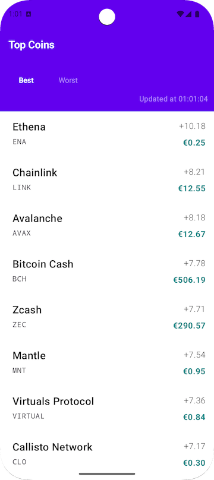
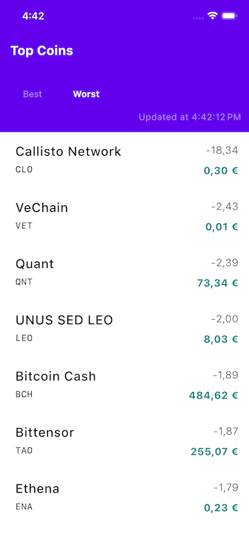

# Top Coins — Kotlin Multiplatform (KMM)

**Top Coins** is a cross-platform (Android & iOS) crypto analytics app, refactored to KMM from an
original Android-only
architecture ([switch to Android-only](https://github.com/inlineTushar/TopCoins/tree/master)).

---

## Preview

| Android                                         | iOS                                     |
|-------------------------------------------------|-----------------------------------------|
|  |  |

---

## Modularization Structure (KMM)

```text
app/                    # Android app
iosApp/                 # iOS (SwiftUI) app hosting Compose
shared/                 # KMM umbrella module (exports everything cross-platform)
  └── common/
        core/           # Core types/utilities
        data/           # Repositories, Ktor/Retrofit
        domain/         # Use cases, models
        ui/             # UI theme/components
        navigation/     # (Android only)
  └── feature/
        coinlist/       # Feature: coin list for both platforms
```

- The `shared` umbrella module gathers all shared (common/feature) modules for Android & iOS.
- Platform launchers (`app`, `iosApp`) are thin and only host the shared code/UI.

---

## KMM Architecture & Principles

- **MVVM** with multiplatform ViewModel (StateFlow), Compose Multiplatform UI on all platforms
- **Clean Architecture**: distinct domain, data, UI modules
- **DI:** Koin multiplatform
- **Modular**: Feature modules, core/domain/data split
- **Tests**: Unit tests in all major modules

---

## Clean Code Practices

| Principle                  | How It's Done                                                      |
|----------------------------|--------------------------------------------------------------------|
| **Separation of Concerns** | Layered Clean Architecture, per-domain modules                     |
| **Testability**            | Unit & UI Tests, DI with Koin                                      |
| **Modularity**             | Feature & domain modules, Compose resource encapsulation           |
| **Build Hygiene**          | Custom Gradle convention plugins                                   |
| **KMM Best-Practices**     | Platform-specific logic in respective sourceSets, umbrella sharing |

---

## API Key Setup

This app requires a personal API key (AUTH_KEY) from [CoinCap](https://coincap.io/).

1. Register at [CoinCap API portal](https://coincap.io/api) to get your API token.
2. Open (or create) `secret/key.properties` in your project (the file is ignored by git).
3. Add your key in the following format (see `key.properties.template` for an example!):

   ```properties
   KEY_COIN_AUTH=<your coincide API token here>
   ```
4. Never commit this file. It is already gitignored for safety!

---

## Switch to Android-only

This is the `KMM` multiplatform branch. For the pure Android
app, [checkout here](https://github.com/inlineTushar/TopCoins/tree/master).

